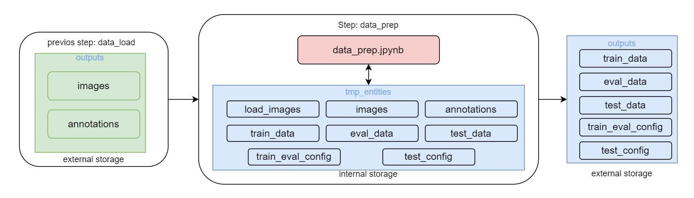

# Step CV-Pipeline: data_prep

This CV-Pipeline component is designed for processing the dataset: checking and cleaning the dataset, transforming the markup, dividing dataset samples into train, valid and test, reviewing and processing data.

Created based on [template](https://github.com/4-DS/step_template).
In order not to forget about the required cells in each laptop, the easiest way to create new jupyter notebooks is simply by copying [`substep_full.ipynb`](https://github.com/4-DS/step_template/blob/main/substep_full.ipynb) from standard [template](https://github.com/4-DS/step_template).

Input data for step CV-Pipeline: data_prep
- **images**     
images of the downloaded dataset (saved as spark parquets)
- **annotations**    
annotation files of the downloaded dataset

The final output of this step CV-Pipeline is
- **train_data**     
training dataset images (saved as spark parquets)
- **eval_data**    
validation dataset images (saved as spark parquets)
- **test_data**    
test dataset images (saved as spark parquets)
- **train_val_config**    
annotation files for the training and validation dataset and the necessary configuration file for subsequent training
- **test_config**    
annotation files for the test dataset and the necessary configuration file to run testing

## How to run a step CV-Pipeline: data_prep

### Create a directory for the project (or use an existing one)
```
mkdir yolox_mmdet
cd yolox_mmdet
```  

### clone the repository: data_prep
```
git clone --recurse-submodules https://gitlab.com/yolox_mmdet/data_prep.git {data_prep}
cd model_train
```  

### run step CV-Pipeline:data_prep
```
python step.dev.py
```  
or
```
step.prod.py
``` 