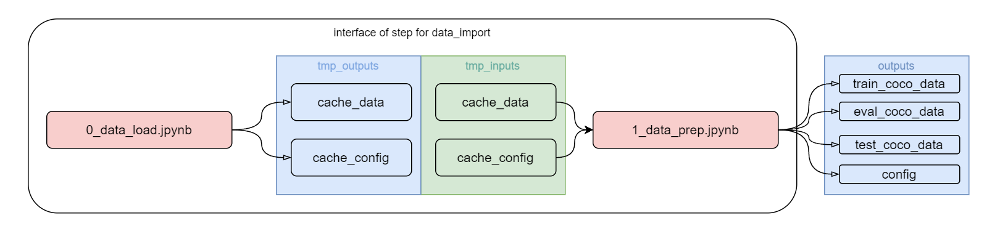
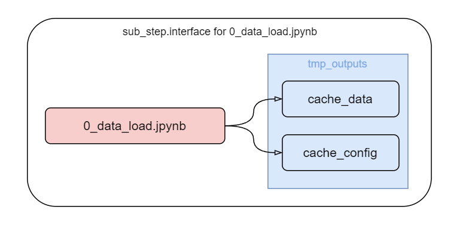
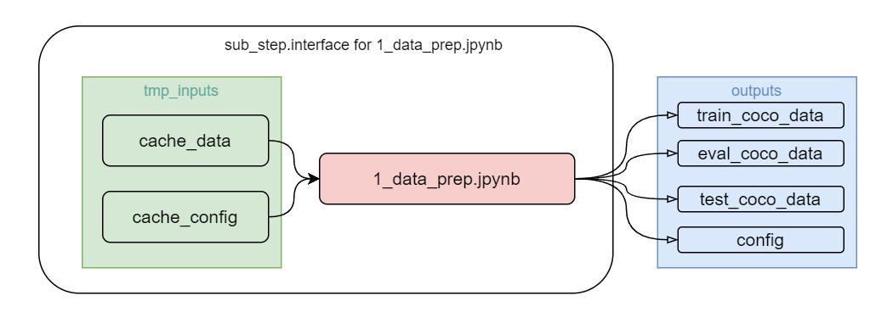

### add sinara module  
```
git submodule add https://github.com/4-DS/sinara.git sinara
```  

### init DSML module  
```
git submodule init
```

### update to latest DSML module
```
git submodule update --remote --merge
```

# Компонента CV-Pipeline: data_import

Загрузка данных из различных источников, выбор данных для модели, разделение данных на train, val, test, data exploration.

Данный компонент создается из [шаблона](https://github.com/4-DS/step_template).

Этот и последующие компоненты будут создаваться из клонированием [шаблона](https://git.nlmk.com/dsml_components/libs/dsml_component_template).

Чтобы не забывать про обязательные ячейки в каждом ноутбуке, проще всего создавать новые ноутбуки просто копированием [`substep_full.ipynb`](https://github.com/4-DS/step_template/blob/main/substep_full.ipynb) из стандартного [шаблона](https://git.nlmk.com/dsml_components/libs/dsml_component_template) компоненты.

Данная компонента разделяется на несколько sub_steps: 
- 0_data_load.ipynb 
- 1_data_prep.ipynb

## `0_data_load.ipynb`
Данный sub_step - ноутбук отвечает за скачивание датасета, для данного примера используется датасет [`COCO`](http://images.cocodataset.org/).     
Для более быстрого запуска и прогона cv-pipeline используем валидационную часть датасета,в дальнейшем для тренирвоки модели разобьем эту часть на train, valid и test датасет.



## `1_data_prep.ipynb`
sub_step 1_data_prep.ipynb отвечает за проверку и чистку датасета, разделение на train, valid и test datasets



Конечным выходом работы данной компоненты CV-Pipeline является четыре выходные директории 
- train_coco_data     
изображения тренировочного датасета (сохранен в spark parquet)
- eval_coco_data    
изображения валидационного датасета (сохранен в spark parquet)
- test_coco_data    
изображения тестового датасета (сохранен в spark parquet)
- config
основные конфигурационные файлы: разметка в формате coco и др.
